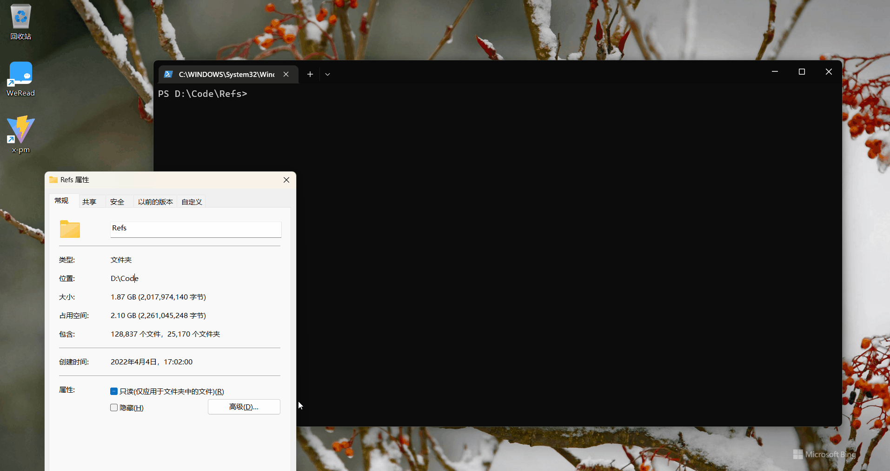

<div align="center">
    
    <h1><a href="https://github.com/markthree/go-get-folder-size">go-get-folder-size</a></h1>
    <p>Get the size of a folder by recursively iterating through all its sub(files && folders). Use go, so high-speed</p>
</div>

<br />

## README 🦉

[简体中文](./README_ZH.md) | English

<br />

## features

- 🐉 [ipc go](./src/bin.ts)
- 🦕 [binary go](./src/bin.ts)
- 🦖 [native node](./src/node.ts)
- 🐊 [wasm go](./src/wasm.ts)

<br />

## motivation

To quickly know the folder size，but
[get-folder-size](https://github.com/alessioalex/get-folder-size) is implemented
by nodejs, which is too slow。

<br />

## Usage

### npm

#### install

```shell
npm install go-get-folder-size
```

#### cli

```shell
# Binary go, fastest
npx go-get-folder-size
```

#### program

```ts
import {
  getFolderSize,
  getFolderSizeBin,
  getFolderSizeWasm,
} from "go-get-folder-size";

const base = "./"; // The directory path you want to get

await getFolderSizeBin(base); // Binary go, fastest

await getFolderSize(base); // native node

await getFolderSizeWasm(base); // Wasm go，slowest
```

##### IPC

Suitable for multi-path

```ts
import { createGetFolderSizeBinIpc } from "go-get-folder-size";

const { getFolderSizeWithIpc, close } = createGetFolderSizeBinIpc();

Promise.all([
  getFolderSizeWithIpc("./"),
  getFolderSizeWithIpc("../"),
])
  .then((vs) => console.log(vs))
  .finally(close); // Manual close is required
```

<br />

### go

#### cli

```shell
go install github.com/markthree/go-get-folder-size
```

```shell
go-get-folder-size
```

#### program

```shell
# Super invincible fast
go get github.com/markthree/go-get-folder-size
```

```go
package main

import (
	getFolderSize "github.com/markthree/go-get-folder-size/src"
)

func main() {
	size, err := getFolderSize.Invoke("./") // Concurrent running, invincible fast

  size2 := getFolderSize.LooseInvoke("./") // Sometimes we may encounter inaccessible files, and we can set 'loose' to ignore them
}
```

## loose

Sometimes we may encounter inaccessible files, and we can set `loose` to ignore
them

### cli

```shell
go-get-folder-size --loose
```

### program

```ts
import {
  getFolderSize,
  getFolderSizeBin,
  getFolderSizeWasm,
} from "go-get-folder-size";

const base = "./"; // The directory path you want to get
const pretty = false; // Human readable way
const loose = true;

await getFolderSizeBin(base, pretty, { loose }); // Binary go, fastest

await getFolderSize(base, pretty, { loose }); // native node

await getFolderSizeWasm(base, pretty, { loose }); // Wasm go，slowest
```

<br />

## stack

- [vite](https://github.com/vitejs/vite)
- [goreleaser](https://github.com/goreleaser/goreleaser)

<br />

## License

Made with [markthree](https://github.com/markthree)

Published under [MIT License](./LICENSE).
